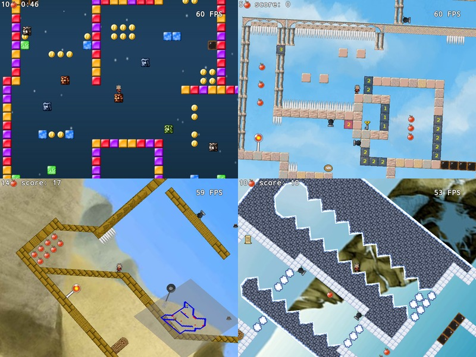

Newton Adventure is a free and open source 2D platform game. You play Newton, a very special hero who has the power to change gravity direction.

It runs on every Linux, Windows, Mac OS X or any OS with Java and OpenGL support.

Code is available under BSD licence, data under CC-BY-SA or more permissive licences.

[Official website](http://devnewton.bci.im/games/newton_adventure)

